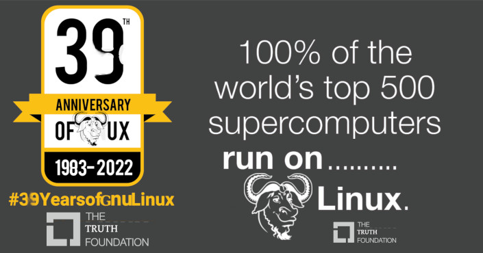

# 一文看懂 Linux 发展历史

文章来自：

- https://www.zhihu.com/tardis/zm/art/200892988?source_id=1005
- https://zhuanlan.zhihu.com/p/146894521
- https://zhuanlan.zhihu.com/p/392588996
- https://zhuanlan.zhihu.com/p/97347275
- https://www.zhihu.com/question/263769115/answer/584223391
- https://zhuanlan.zhihu.com/p/381753464

## 前置知识

### UNIX

时光追溯到上世纪六十年代，多数计算机都采用批处理命令。为了研发一个多用途，多用户的操作系统。有三个著名的公司联合起来进行研发。三个知名的公司是美国电话及电报公司（American Telephone and Telegraph Inc.；AT&T）、通用电器公司（General Electrics；G.E.）及麻省理工学院（Massachusetts Institute of Technology；MIT）。整个项目研发出来的操作系统被称之为 MULTICS。可是后来，MULTICS 项目开始迷失，目标过于庞大，功能过于复杂，研发的人们越来越不明白这个项目将会如何走下去。最终隶属 AT&T 公司的贝尔实验室（Bell Labs）退出了这个项目。

值得一提的是 Bell Labs 。这个实验室在整个人类科技史上都占据重要地位，电话就是在这个实验室诞生。里面有着才华卓越的工程师和黑客。由于贝尔实验室退出了 MULTICS，那些习惯了使用 MULTICS 的贝尔实验室工程师突然之间无法使用 MULTICS，这无疑类似把剑客的剑给没收了。当时贝尔实验室有个叫 Ken Thompson 的人，他负责为为 MULTICS 这个操作系统写游戏了个叫“Space Travel”的游戏。为了让这个游戏能继续下去，他不得不重新编写一个操作系统。当他去申请计算机的时候，显然领导不会因为一个游戏批准你一台计算机。早起的计算机并不像我们现在的 pc 机那么小巧。当时计算机可是巨无霸，每一台的造价也极其昂贵，只有企业和科研机构才能买得起。

Ken 无法得到 pdp-11，却在一个角落了发现了 pdp-7，虽然这个机器已经落后， Ken 还是觉得如获至宝，随后他很顺利的用汇编完成了操作系统，并写完了游戏。有趣的是，Ken 的一个同事 Brian Kernighan 非常不喜欢这个系统，嘲笑 Ken Thompson 说：“你写的系统好真烂，干脆叫 Unics 算了。”（unics 在英文里表示单一，与 mult 相反）。Ken 对 Brian 的评价到没有多大排斥，本身他的目标是游戏，而不是操作系统，也接受了同事的命名。然后他更乐于推广他的游戏，让同事们茶余饭后娱乐娱乐。那时是1969年8月，恰巧这一年，芬兰诞生了一个婴儿，**Linus Torvalds**（记住这个名字）来到这个世界。

Ken 的另一个同事 Dennis Ritchie 对 Ken 的游戏没有多大兴趣，倒是对 Unics 情有独钟。当时 Ken 用汇编完成的 Unics，如果换到 pdp-11上，Unics 想要运行必须重新冲重新编写代码移植。Ken 无法为当时不同的机型提供上百个 Unics 版本。这时，Dennis Ritchie 在 BCPL 基础上，开发了一种新的高级语言将 Unics 重新写了一遍，并命名为 UNIX。这个语言是将 BCPL 语言进行了升级，也就是后来大名鼎鼎的 C 语言。尽管是游戏和嘲讽，**Unix 和 C 诞生了**，并且完美地结合成为一个统一体，C 与 Unix 很快成为世界的主导。

为了私有化 Unix，1986年 IEEE 指定了一个委员会制定了一个一个开放作业系统的标准,称为 POSIX (Portable Operating Systems Interface)。并和 BSD 进行法律官司，AT&T 再次被反垄断，这场官司一直打到 AT&T 再将自己的 Unix 系统实验室卖掉。当然，AT&T 的 Unix 取得了这个标准制订战争的胜利，并取得了 Unix 注册商标。此时 BSD 的拥护者自喻为冷酷无情的公司帝国的反抗军。独立的 Bell 实验室就可以单独销售 Unix，当时价格昂贵。也就在这个时候，人们被昂贵的 Unix 吓怕了，使用的人数骤减。

### POSIX

POSIX：可移植操作系统接口（Portable Operating System Interface of UNIX，缩写为 POSIX ），发布者为电气与电子工程师协会（Institute of Electrical and Electronics Engineers），简称 IEEE。POSIX 是 IEEE 为要在各种 UNIX 操作系统上运行的软件而定义的一系列 API 标准的总称，其正式称呼为 IEEE 1003，而国际标准名称为 ISO/IEC 9945。

**POSIX 是 Unix 的标准**。

1974年，贝尔实验室正式对外发布 Unix。因为涉及到反垄断等各种原因，加上早期的 Unix 不够完善，于是贝尔实验室以慷慨的条件向学校提供源代码，所以 Unix 在大专院校里获得了很多支持并得以持续发展。

20世纪80年代中期，Unix 厂商试图通过加入新的、往往不兼容的特性来使它们的程序与众不同。
局面非常混乱，麻烦也就随之而来了。
为了提高兼容性和应用程序的可移植性，阻止这种趋势， IEEE(电气和电子工程师协会)开始努力标准化 Unix 的开发，后来由 Richard Stallman 命名为“Posix”。

这套标准涵盖了很多方面，比如 Unix 系统调用的 C 语言接口、shell 程序和工具、线程及网络编程。

### GNU

Unix 系统被发明之后，大家用的很爽。但是后来开始收费和商业闭源了。一个叫 RMS 的大叔觉得很不爽，于是发起 GNU 计划，GNU 是 “GNU's Not Unix” 的递归缩写。模仿 Unix 的界面和使用方式，从头做一个开源的版本。然后**他自己做了编辑器 Emacs 和编译器 GCC**。GNU 是一个计划或者叫运动。在这个旗帜下成立了 FSF，起草了 GPL 等。接下来大家纷纷在 GNU 计划下做了很多的工作和项目，基本实现了当初的计划。包括核心的 gcc 和 glibc。

但是 GNU 系统缺少操作系统内核。原定的内核叫 HURD，一直完不成。同时 BSD（一种 UNIX 发行版）陷入版权纠纷，x86 平台开发暂停。然后一个叫 Linus 的同学为了在 PC 上运行 Unix，在 Minix 的启发下，开发了 Linux。

## Linux 简史

Linux 是一套免费使用和自由传播的类 Unix 操作系统，是一个基于 POSIX 和 Unix 的多用户、多任务、支持多线程和多 CPU 的操作系统。Linux 与其他操作系统相比 ，具有开放源码、没有版权、技术社区用户多等特点 ，开放源码使得用户可以自由裁剪，灵活性高，功能强大，成本低。尤其系统中内嵌网络协议栈 ，经过适当的配置就可实现路由器的功能。这些特点使得 Linux 成为开发路由交换设备的理想开发平台。

Linux 操作系统的诞生、发展和成长过程始终依赖着五个重要支柱：**Unix 操作系统、MINIX 操作系统、GNU 计划、POSIX 标准和 Internet 网络**。

由于供教学使用的典型操作系统很少，因此当时在荷兰当教授的美国人 AndrewS.Tanenbaum 编写了一个操作系统，名为 MINIX，为了向学生讲述操作系统内部工作原理。MINIX 虽然很好，但只是一个用于教学目的的简单操作系统，而不是一个强有力的实用操作系统，然而最大的好处就是公开源代码。全世界学计算机的学生都通过钻研 MINIX 源代码来了解电脑里运行的 MINIX 操作系统，芬兰赫尔辛基大学大学二年级的学生 **Linus Torvalds** 就是其中一个，在吸收了 MINIX 精华的基础上，Linus 于1991年写出了属于自己的 Linux 操作系统，版本为 Linux0.01，是 Linux 时代开始的标志。他利用 Unix 的核心，去除繁杂的核心程序，改写成适用于一般计算机的 x86系统，并放在网络上供大家下载，1994年推出完整的核心 Version1.0，至此，Linux 逐渐成为功能完善、稳定的操作系统，并被广泛使用。

Linux 提倡**自由、开源、共享、人人为我，我为人人**。在 GPL 的号召下，全世界的 Linux 开发者组成了一个虚拟的开源社区。这是一种非常优秀的组织结构，尽管大家分布在世界各地，但是可以通过源代码和互联网进行高效的无障碍交流。大家既从开源社区获取资源，也把自己的贡献回馈给开源社区。

从技术角度来说，Linux **只是操作系统内核**，而不是一个完全的类 UNIX 操作系统，这是因为它不包含全部的 UNIX 应用程序，诸如文件系统实用程序、命令解释器、窗口系统、图形化桌面、系统管理员命令、文本编辑程序、编译开发程序等。以上这些应用程序大部分都可在 **GNU** 公共许可证下免费获得，因此包含 Linux 内核、基础运行环境（运行时库如 GLibc）、编译环境（如 GCC）、外壳程序（Shell，即命令解释器）和图形操作界面（GUI）的完整操作系统套件被称为 **GNU/Linux**。尽管如此，在大多数情况下，仍用 Linux 来指代完整的 GNU/Linux。

Linux 内核是一体化内核（或称宏内核）操作系统，宏内核的设计风格是“凡是可以在内核里实现的都在内核里实现”。因此，除了异常/中断处理、内存管理和进程管理三大基本功能以外，文件系统、设备驱动和网络协议也放在内核层实现。

## Linux 的应用

"100% of world's top 500 supercomputers run on Linux"

Linux 虽然比 Windows 和 Unix 晚出现，但是目前已经占据了90%以上的市场，像 BAT/TMD 甚至微软官方门户网站都是使用的 Linux 系统。利用 Linux 系统可以为企业架构 WWW 服务器、数据库服务器、负载均衡服务器、邮件服务器、DNS 服务器、代理服务器、路由器等，不但使企业降低了运营成本，同时还获得了 Linux 系统带来的高稳定性和高可靠性，且无须考虑商业软件的版权问题。目前 Linux 系统已经参透到电信、金融、政府、教育、银行、石油等各个行业，同时各大硬件厂商也相继支持 Linux 操作系统。

## Linux 分支

Debian 系列主要包含 Debian 和 Ubuntu 等。Debian 最具特色的是 apt-get/dpkg 包管理方式，在二进制文件发行方式中，APT 应该是最好的了。Debian 的资料也很丰富，有很多支持的社区，比较方便找到解决问题的方法。Debian 社区的网址：https://debian.cn/。

Debian 自家纯净系统，一般来说 Debian 适合于服务器操作系统，它比 Ubuntu 要稳定得多。Debian 这款操作系统派生出了多个 Linux 发行版，有37500多个软件包，使用方便，Debian 使用 apt 或 aptitude 来安装和更新软件。

Ubuntu 名称来源于非洲南部祖鲁语的“ubuntu”一词(译为吾帮托或乌班图), 意思是“人性”。Ubuntu 是 Debian 的一款衍生版，基于 Debian 发行版和 GNOME 桌面环境，并在 Debian 系统上封装了许多工具。Ubuntu 有着漂亮的用户界面，完善的包管理系统，强大的软件源支持，丰富的技术社区，广泛应用于桌面机、服务器、云计算等各领域。同时 Ubuntu 是免费的，是非常受欢迎的 Linux 系统。 Ubuntu 使用 apt-get 命令安装软件包，跟 CentOS 不同的是，它不支持 rpm 格式的安装。

RHEL(Red Hat Enterprise Linux)：RHEL 是面向企业客户的 Linux 发行版，是一款收费的操作系统。它支持虚拟化技术、多核处理等；安全性高，稳定可靠。

CentOS（Community ENTerprise Operating System），中文称作社区企业操作系统。它是一款企业级 Linux 发行版，是使用红帽 Linux 中的免费源代码重新构建而成。CentOS 是免费的、开源的、可以重新分发的开源操作系统。CentOS 人群数量大，资料非常多；包管理方式采用基于 RPM 包的 YUM 包管理方式，包分发方式是编译好的二进制文件；CentOS 稳定性非常好，适合于搭建公司服务器使用。

## BSD 与 Linux

> BSD is what you get when a bunch of UNIX hackers sit down to try to port a UNIX system to the PC. Linux is what you get when a bunch of PC hackers sit down and try to write a UNIX system for the PC.
> 
> BSD 是黑客们试图将 Unix 移植到电脑上出现的，而 Linux 则是黑客们尝试在电脑上写一个 Unix。

> Linux 他们做的事是因为他们讨厌微软，我们所做的事情是因为我们热爱 Unix。
>
> —— OpenBSD 创始人 Theo de Raadt

BSD（Berkeley Software Distribution，也称 Berkeley Unix），作为 Unix 最绕不开的一族分支，它的摇篮是当时美国最为激进的左派大本营 —— 加州大学伯克利分校。在这个以自由著称的学校，老学长 Ken Thompson 创造并带回了 Unix，小学弟 Bill Joy 接力发展了 BSD，经过更多校内校外参与者的一起努力，才从一场浩劫中保下了这一不同于 GNU/Linux 一派的“开源火种”。

1977 年开始，AT&T 分解后终于摆脱反垄断的掣肘，立马将 Unix 进行商业化。从 1979 年 UNIX 的 V7 版本开始，Unix 的许可证开始禁止大学使用 Unix 源码，包括在授课中学习。如果想要继续使用，就要支付价格不菲的费用得到授权。

至此，UNIX 开始分为两大流派： AT&T 一路的商业化版本 Unix 和 BSD 系列（其中前者是闭源的，而 BSD 是开放源代码的）。这种格局在 1990 年代初期达到极盛，各路 Unix 版本达到了 100 多种，其中包括 SUNOS、IBM AIX、HP-UX、DEC Ultrix 与 SCO Xenix、Sun Solaris 等。这些 Unix 变种均基于 Unix 开源版本派生而来，且多为闭源的商业版。

90 年代初期，BSDi（伯克利计算机研究小组 CSRG 成立的公司）开始销售其自己的 Berkeley Unix 版本，而加州大学多年来一直在销售其版本。1992 年，AT&T 起诉加州大学和 BSDi，声称 BSD Unix 包含专有的 AT&T 代码。但实际上，AT&T 当时推出的 Unix 版本 System 5 也包含了最初由 BSD 黑客编写的大量代码 —— 包括 TCP/IP 堆栈。

于是，像 McKusick 这样的黑客被激怒了。加州大学的律师抓住了这一机会，以侵犯版权为由向 AT&T 提出反诉。一场浩浩荡荡、留名史册的版权战争就此拉开序幕。众多支持开源的工程师们把自己形象的比喻为《星球大战》中的自由反抗军联盟，对抗邪恶的垄断帝国。在后来，不少历史学者都将伯克利黑客描述为“自由斗士”。就像后人的评判那样：他们中没有一个人将自己视为十字军，但时不时会渗出一丝理想主义。

就当 BSD 深陷泥淖之中时，开源世界众所周知的另一个故事也正在发生：1984 年，RMS 打出“GNU's not Unix” 的标语，发起自由软件（Free Software）运动；1991年，Linux 诞生，开源世界里的最大宇宙 —— GNU/Linux 话语体系就此形成。接下来，Linux 发展，而 BSD 让出了 C 位。

Linus 起初还是个芬兰大学生，因为买不起工作站，只好自己写了一个能在 386 上运行的操作系统。而如果他要是早知道 BSD 没有法律问题，并且可以被移植到 386，他就会加入 BSD 的开发，而不是自己写一个。（真有意思，这场官司还改变了 Linus 的命运。）

Linux 和 BSD 都是类 UNIX 操作系统。我们可以通过阅读类 UNIX 操作系统历史发现 Linux 和 BSD 有不同的谱系。

Linux 是由 Linus Torvalds 在芬兰上大学的时候开发的。

BSD 则代表“Berkeley Software Distribution，伯克利软件套件”，其源于对加州大学伯克利分校所开发的贝尔实验室 UNIX 的一系列修改，它最终发展成一个完整的操作系统，现在有多个不同的BSD分支。

严格的说，Linux 是只是一个内核。制作 Linux 发行版所要做的工作就是，汇集那些创建一个完整 Linux 操作系统所需的所有软件，将它组合成一个像 Ubuntu、Mint、Debian、RedHat 或者是 Arch 这样的 Linux 发行版。有许多不同的 Linux 发行版。

与此相反的是，BSD 这个名字则代表其内核和操作系统。例如，FreeBSD 提供了 FreeBSD 内核和 FreeBSD 操作系统。它是作为一个单一的项目维护的。换句话说，如果你想要安装 FreeBSD，就只有一个 FreeBSD 可供你安装。如果你想要安装 Linux，你首先需要在许多 Linux 发行版之间选择。

许可证是典型的差异，虽然它不会对大多数人产生影响。Linux 使用 GNU 通用公共许可证，即 GPL。如果你修改了 Linux 内核，并将其分发，你就必须放出您的修改的源代码。

BSD 使用 BSD 许可证。如果你修改了 BSD 内核或发行版，并且发布它，你根本不需要必须发布其源代码。你可以自由地对你的 BSD 代码做任何你想做的事情，你没有义务发布的你修改的源代码，当然你想发布也行。

两者都是开放源码的，但是以不同的方式。人们有时会陷入关于哪种许可证是“更自由”的辩论。GPL 可以帮助用户以确保他们可以拥有 GPL 软件的源代码，并限制开发人员迫使他们开放代码。BSD 许可证并不能确保用户可以拥有源代码，而是给开发人员选择是否公布代码的权利，即使他们想要把它变成一个闭源项目。