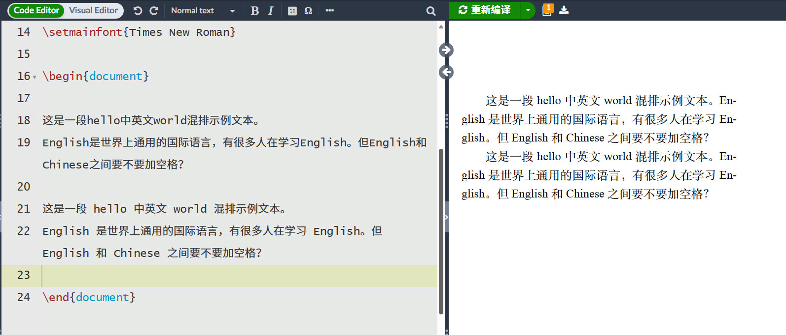
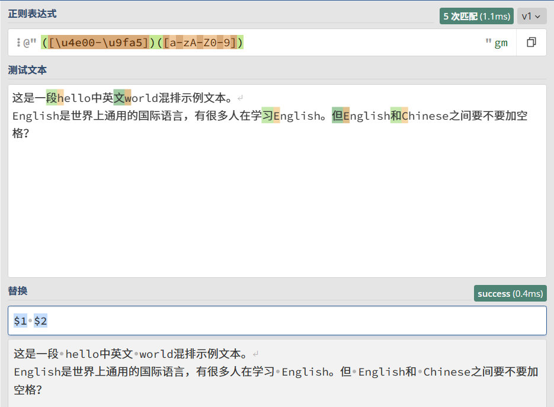

# 中文与英文中间请加空格

*除引用外，本文章为原创*

> 中文正文及标题中出现的英文及数字应该使用半角方式输入，并且在左右各留一个半角空格。如果这些这些半角英文及数字的左边或者右边紧接着任何的中文全角括号或者其他标点符号的话，则不需要加入半角空格。
> @Livid 《中文 Web 阅读体验》

> 横排时，西文使用比例字体；阿拉伯数字则常用比例字体或等宽字体。原则上，汉字与西文字母、数字间使用不多于四分之一个汉字宽的字距或空白。但西文出现在行首或行尾时，则无须加入空白。
> W3C 《中文排版需求》

## Word 中的排版特性

在用 word 排版时，word 能够自动处理（添加）汉字与英文中间的空白，尽管原文中二者之间并没有空格，word 也会让它们看起来有一个空格。微信也有同样的行为。这些都导致我们没有关注汉字与英文之间空格的问题。

## LaTeX 中的排版特性

LaTeX 的行为是，无论你是否在英文和中文之间添加一个空格，LaTeX 都能智能地在 PDF 中正确处理中英文间距的问题。但仍然推荐手动添加空格。

## 在线工具

这些工具都可以在线添加空格：

- https://www.lddgo.net/string/add-space-between-chinese-and-english
- https://www.quanxiaoha.com/tools/wenzi-paiban/
- https://www.wetools.com/type-setting

## 没有在线支持的情况

使用各类强大的编辑器 + 正则表达式一样可以完成操作。我曾经甚至想用 Python 实现一个简单的状态机，在遍历文本时，动态地处理中英文空格的问题。但其实，只需要用正则匹配 `(汉字)(字母)` 并替换为 `$1 $2`，然后颠倒匹配顺序 `(字母)(汉字)` 再替换为 `$1 $2` 即可。

正则表达式如下：

- `([\u4e00-\u9fa5])([a-zA-Z0-9])`
- `([a-zA-Z0-9])([\u4e00-\u9fa5])`

