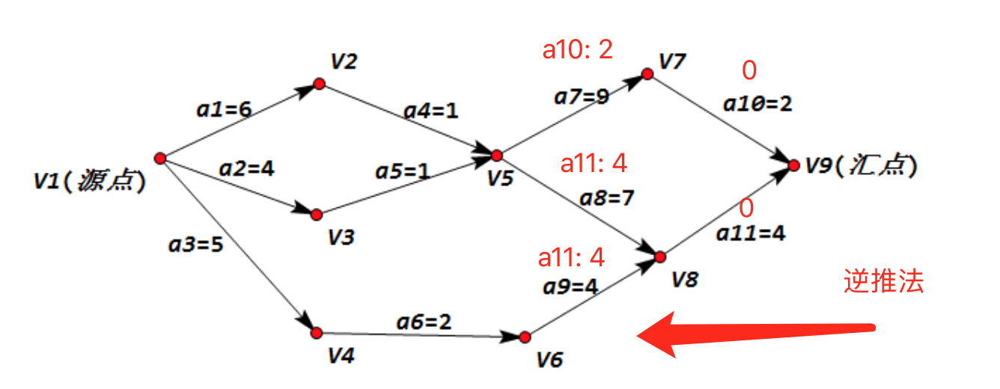
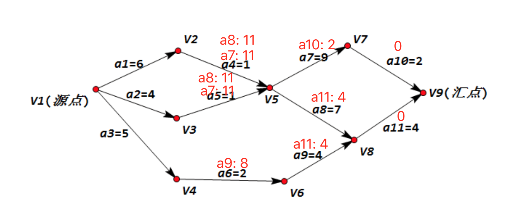
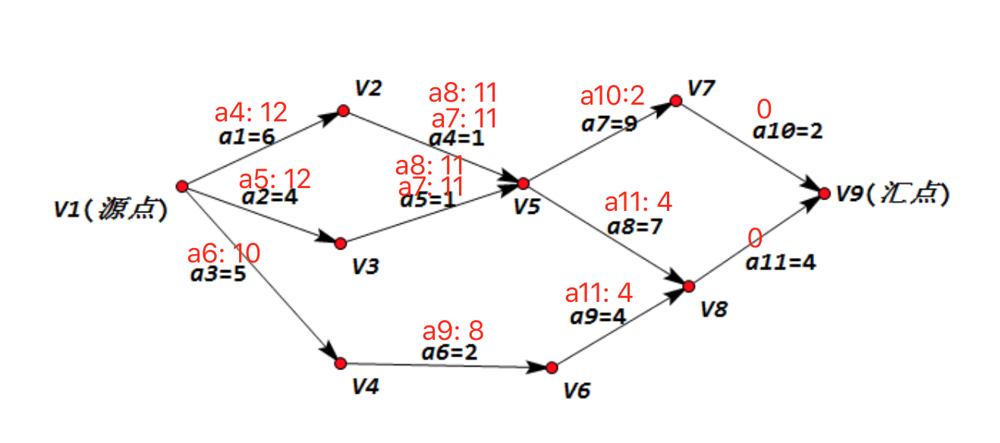
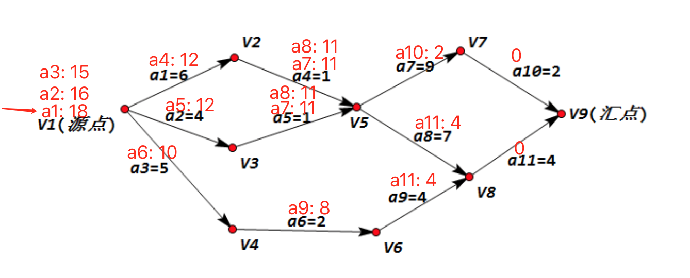
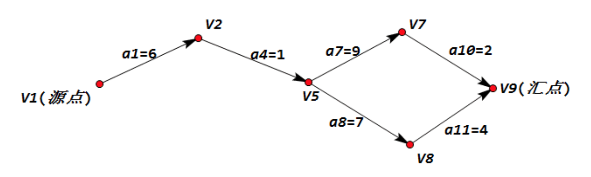

# 快速掌握手动求关键路径

## 逆推法

从最末端的活动开始：

step1：将最末端的活动时间标记为`0`（这里选汇点，将汇点当做一个虚活动），活动`a10`与`0`相加，标注在它的前置活动`a7`上方，同理，活动`a11`与`0`相加，标注在它的前置活动上方（这里`a11`有两个前置活动，都要标注）：
依次选最大往前加，标注在前一个活动上方:



step2. 活动a7与标注它上方的a10相加，标注它前一个活动上方，由于a7是直接后继活动，所以它的前导活动a4上方标记a7，这里a4也是a8的前导活动，我们要选关键路径，就是要选最大，但是这里有个尴尬的地方，a7和a8算下来都是11，a8和a9同理：



step3. 继续往前推，活动a4的前导活动是活动a1，有个要注意的地方，活动a4上方的活动有多个，这里我们要选活动时间最大的和a4相加，然后标记到活动a1上方，活动a5和a6同理，分别标注到它们的前导活动a2和a4的上方：




step4. 将源点也当做一个虚活动，将a1，a2，a3计算后的结果标注在源点上方，继续选最大，得出关键路径长度 18：



最后，从左往右看 a1， a1上方标注的a4，然后到a4，a4上方标注的a7和a8，说明关键路径有两条，继续往后推一直到汇点。所以关键路径为：

a1 --> a4 --> a7 --> a10

a1 --> a4 --> a8 --> a11



## 拓扑排序算法

算法的基本思路:

从AOV网中选择一个入度为0的顶点输出，然后从这删去次顶点，并删除以此顶点为尾的弧。继续重复次步骤，直到输出全部顶点或者AOV网中不存在入度为0的顶点为止。

在这个算法的实现过程中，需要借助一个数据结构栈来帮助解决避免每次查找时，都去遍历AOV图中的顶点表查找有没有入度为0的顶点。

### 定义类型

```cpp
#define OK 1
#define ERROR 0
#define TRUE 1
#define FALSE 0
#define MAXEDGE 20
#define MAXVEX 14
#define INFINITYC 65535

/* Status是函数的类型,其值是函数结果状态代码，如OK等 */
typedef int Status;
```

### 邻接矩阵

```cpp
/*邻接矩阵结构 */
typedef struct
{
    int vexs[MAXVEX];
    int arc[MAXVEX][MAXVEX];
    int numVertexes, numEdges;
}MGraph;
```

### 边表结点

```cpp
//边表结点
typedef struct EdgeNode
{
    //邻接点域，存储该顶点对应的下标
    int adjvex;
    //用于存储权值，对于非网图可以不需要
    int weight;
    //链域，指向下一个邻接点
    struct EdgeNode *next;
}EdgeNode;
```

### 顶点表节点

```cpp
//顶点表结点
typedef struct VertexNode
{
    //顶点入度
    int in;
    //顶点域，存储顶点信息
    int data;
    //边表头指针
    EdgeNode *firstedge;
}VertexNode, AdjList[MAXVEX];
```

### 图结构

```cpp
//图结构
typedef struct
{
    AdjList adjList;
    //图中当前顶点数和边数
    int numVertexes,numEdges;
}graphAdjList,*GraphAdjList;
```

### 拓扑排序算法

```cpp
/*拓扑排序. 若AOV网图无回路则输出拓扑排序的序列并且返回状态值1,若存在回路则返回状态值0*/
/*拓扑排序:解决的是一个工程能否顺序进行的问题!*/
Status TopologicalSort(GraphAdjList GL){
    
    EdgeNode *e;
    int i,k,gettop;
    //用于栈指针下标
    int top=0;
    //用于统计输出顶点的个数
    int count=0;
    
    //建栈将入度为0的顶点入栈(目的:为了避免每次查找时都要遍历顶点表查找有没有入度为0的顶点)
    int *stack=(int *)malloc(GL->numVertexes * sizeof(int) );
    
    //1.遍历邻接表-顶点表,将入度in为0的顶点入栈
    /*参考图1> 此时stack栈中应该成为0,1,3.即V0,V1,V3的顶点入度为0*/
    for(i = 0; i<GL->numVertexes; i++)
        //将入度为0的顶点入栈
        if(0 == GL->adjList[i].in)
            stack[++top]=i;
    printf("top = %d\n",top);
    
    //2.循环栈结构(当栈中有元素则循环继续)
    while(top!=0)
    {
        //出栈
        gettop=stack[top--];
        printf("%d -> ",GL->adjList[gettop].data);
        
        //输出顶点，并计数
        count++;
        
        //遍历与栈顶相连接的弧
        for(e = GL->adjList[gettop].firstedge; e; e = e->next)
        {
            //获取与gettop连接的顶点
            k=e->adjvex;
            
            //1.将与gettop连接的顶点入度减1;
            //2.判断如果当前减1后为0,则入栈
            if( !(--GL->adjList[k].in) )
                //将k入栈到stack中,并且top加1;
                stack[++top]=k;
        }
    }
    
    /*思考:3 -> 1 -> 2 -> 6 -> 0 -> 4 -> 5 -> 8 -> 7 -> 12 -> 9 -> 10 ->13 -> 11
     这并不是唯一的拓扑排序结果.
     分析算法:将入度为0的顶点入栈的时间复杂度为O(n), 而之后的while 循环,每个顶点进一次栈,并且出一次栈. 入度减1, 则共执行了e次. 那么整个算法的时间复杂度为O(n+e)*/
    
    printf("\n");
    
    //判断是否把所有的顶点都输出. 则表示找到了拓扑排序;
    if(count < GL->numVertexes)
        return ERROR;
    else
        return OK;
}
```

## 关键路径算法

### C 语言

```cpp
//求关键路径, GL为有向网,则输出G的各项关键活动;
void CriticalPath(GraphAdjList GL){
    EdgeNode *e;
    int i,gettop,k,j;
    
    //声明活动最早发生时间和最迟发生时间变量;
    int ete,lte;
    
    //求得拓扑序列,计算etv数组以及stack2的值
    TopologicalSort(GL);
   
    //打印etv数组(事件最早发生时间)
    printf("etv:\n");
    for(i = 0; i < GL->numVertexes; i++)
        printf("etv[%d] = %d \n",i,etv[i]);
    printf("\n");
    
    //事件最晚发生时间数组
    ltv = (int *)malloc(sizeof(int) * GL->numVertexes);
   
    //初始化ltv数组
    for (i = 0; i < GL->numVertexes; i++) {
        //初始化ltv数组. 赋值etv最后一个事件的值
        ltv[i] = etv[GL->numVertexes-1];
        //printf("ltv[%d] = %d\n",i,ltv[i]);
    }
    
    //计算ltv(事件最晚发生时间) 出栈求ltv
    while (top2 != 0) {
        
        //出栈(栈顶元素)
        gettop = stack2[top2--];
        
        //找到与栈顶元素连接的顶点; 例如V0是与V1和V2连接
        for (e = GL->adjList[gettop].firstedge; e; e = e->next) {
            //获取与gettop 相连接的顶点
            k = e->adjvex;
            //计算min(ltv[k]-e->weight,ltv[gettop])
            if (ltv[k] - e->weight < ltv[gettop]) {
                //更新ltv 数组
                ltv[gettop] = ltv[k] - e->weight;
            }
        }
    }
    
    //打印ltv 数组
    printf("ltv:\n");
    for (i = 0 ; i < GL->numVertexes; i++) {
        printf("ltv[%d] = %d \n",i,ltv[i]);
    }
    
    printf("\n");
    //求解ete,lte 并且判断lte与ete 是否相等.相等则是关键活动;
    //2层循环(遍历顶点表,边表)
    for(j=0; j<GL->numVertexes;j++)
    {
        for (e = GL->adjList[j].firstedge; e; e = e->next) {
            //获取与j连接的顶点;
            k = e->adjvex;
            //ete 就是表示活动 <Vk, Vj> 的最早开工时间, 是针对这条弧来说的.而这条弧的弧尾顶点Vk 的事件发生了, 它才可以发生. 因此ete = etv[k];
            ete = etv[j];
            //lte 表示活动<Vk, Vj> 的最晚开工时间, 但此活动再晚也不能等Vj 事件发生才开始,而是必须在Vj 事件之前发生. 所以lte = ltv[j] - len<Vk, Vj>.
            lte = ltv[k]-e->weight;
            //如果ete == lte 则输出j,k以及权值;
            if (ete == lte) {
                printf("<%d-%d> length:%d\n",GL->adjList[j].data, GL->adjList[k].data, e->weight);
            }
        }
    }
    
}
```

### java

```java
public class CriticalPath {
    /** 边 */
    static class Edge{
        /** 权重 */
        int weight;
        /** 出度指向的点 */
        int toVertex;
        Edge next;
        public Edge(int weight, int toVertex, Edge next) {
            this.weight = weight;
            this.toVertex = toVertex;
            this.next = next;
        }
    }
    /** 顶点 */
    static class Vertex{
        /** 入度 数量 */
        int inNumber;
        /** 顶点信息 */
       Integer data;
        /** 第一条边 */
        Edge firstEdge;
        public Vertex(int inNumber, Integer data, Edge firstEdge) {
            this.inNumber = inNumber;
            this.data = data;
            this.firstEdge = firstEdge;
        }
    }
    static void criticalPath(List<Vertex> graph){
        //顶点数量
        int length = graph.size();
        //边数量
        int numOfEdges = 0;
        for (Vertex vertex : graph) {
            Edge edge = vertex.firstEdge;
            while (edge!=null){
                numOfEdges ++;
                edge = edge.next;
            }
        }
        //事件最早发生时间
        int[] etv = new int[length];
        //事件最晚发生时间
        int[] ltv = new int[length];
        //活动最早发生时间
        int[] ete = new int[numOfEdges];
        //活动最晚发生时间
        int[] lte = new int[numOfEdges];
        //1. 通过拓扑排序求 etv 「事件最早发生时间」
        //etvStack 用于储存拓扑排序后的顺序
        Stack<Vertex> etvStack = new Stack<>();
        //stack 用于拓扑排序
        Stack<Vertex> stack = new Stack<>();
        for (Vertex vertex : graph) {
            if (vertex.inNumber == 0){
                stack.push(vertex);
            }
        }
        while (!stack.isEmpty()){
            Vertex pop = stack.pop();
            //储存拓扑排序后的结构
            etvStack.push(pop);
            //遍历出度
            Edge edge = pop.firstEdge;
            while (edge != null){
                Vertex vertex = graph.get(edge.toVertex);
                vertex.inNumber --;
                if (vertex.inNumber == 0){
                    stack.push(vertex);
                }
                //赋值更大的距离给 etv
                if (etv[pop.data] + edge.weight > etv[edge.toVertex]){
                    etv[edge.toVertex] = etv[pop.data] + edge.weight;
                }
                edge = edge.next;
            }
        }
        //2.通过 etv 反向推导求出 ltv「事件最晚发生时间」
        System.out.println("====etv====");
        for (int i = 0; i < etv.length; i++) {
            System.out.print("V"+i +" = "+etv[i]+" ");
        }
        System.out.println();

        //初始化 ltv
        Integer endVertex = etvStack.peek().data;
        for (int i = 0; i < ltv.length; i++) {
            ltv[i] = etv[endVertex];
        }
        while (!etvStack.isEmpty()) {
            Vertex pop = etvStack.pop();
            Edge edge = pop.firstEdge;
            while (edge != null) {
                //赋值更小的距离给 ltv
                if (ltv[pop.data] > ltv[edge.toVertex] - edge.weight) {
                    ltv[pop.data] = ltv[edge.toVertex] - edge.weight;
                }
                edge = edge.next;
            }
        }
        System.out.println("====ltv====");
        for (int i = 0; i < ltv.length; i++) {
            System.out.print("V"+i +" = "+ltv[i]+" ");
        }
        System.out.println();
        //3. 通过 etv 求 ete
        int index = 0;
        for (Vertex vertex : graph) {
            Edge edge = vertex.firstEdge;
            while (edge != null){
                ete[index++] = etv[vertex.data];
                edge = edge.next;
            }
        }
        System.out.println("====ete====");
        for (int i = 0; i < ete.length; i++) {
            System.out.print("E"+i +" = "+ete[i]+" ");
        }
        System.out.println();
        //4. 通过 ltv 求 lte
        index = 0;
        for (Vertex vertex : graph) {
            Edge edge = vertex.firstEdge;
            while (edge != null){
                lte[index++] = ltv[edge.toVertex] - edge.weight;
                edge = edge.next;
            }
        }
        System.out.println("====lte====");
        for (int i = 0; i < lte.length; i++) {
            System.out.print("E"+i +" = "+lte[i]+" ");
        }
        System.out.println();
        //5. 用 lte - ete 求关键路径 
        System.out.println("====关键路径====");
        for (int i = 0; i < ete.length; i++) {
            if (lte[i] - ete[i] == 0) {
                System.out.print("E"+i+" ");
            }
        }
        return ;
    }

    /** 测试 */
    public static void main(String[] args) {
        char[] vertices = new char[]{'A','B','C','D','E','F','G'};
        Edge e3 = new Edge(2, 4, null);
        Edge e2 = new Edge(1, 3, e3);
        Edge e1 = new Edge(3, 2, e2);
        Edge e0 = new Edge(2, 1, e1);
        Edge e4 = new Edge(1, 5, null);
        Edge e5 = new Edge(1, 5, null);
        Edge e6 = new Edge(1, 5, null);
        Edge e7 = new Edge(1, 5, null);
        Edge e8 = new Edge(2, 6, null);
        Vertex a = new Vertex(0, 0, e0);
        Vertex b = new Vertex(1, 1, e4);
        Vertex c = new Vertex(1, 2, e5);
        Vertex d = new Vertex(1, 3, e6);
        Vertex e = new Vertex(1, 4, e7);
        Vertex f = new Vertex(4, 5, e8);
        Vertex g = new Vertex(1, 6, null);
        ArrayList<Vertex> graph = new ArrayList<>();
        graph.add(a);
        graph.add(b);
        graph.add(c);
        graph.add(d);
        graph.add(e);
        graph.add(f);
        graph.add(g);
        criticalPath(graph);
    }
}
```