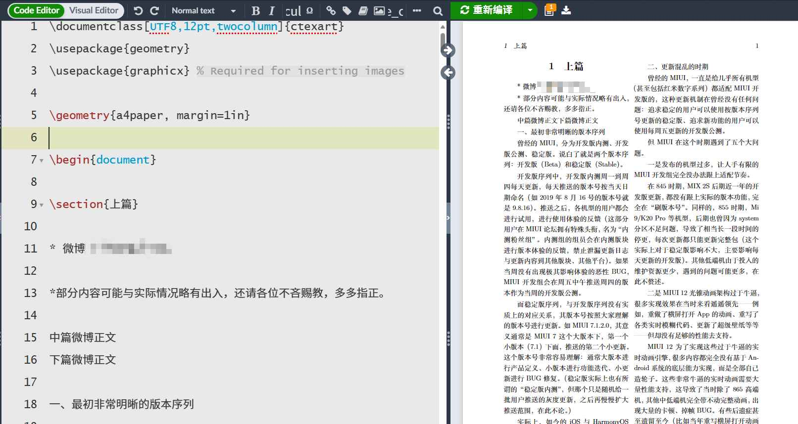

# 先写再排版，还是边写边排版

*全文原创*

**注**：专业平面设计和商业出版物（如艺术杂志、宣传海报、UI/UX 设计等）不在讨论范围内。

## 问题描述

许多人，包括网上的排版教程，似乎都在推荐**先写内容再排版**。但根据我的经历，在进行严肃排版（如科技论文、技术手册）时，Word 有些特性十分恼人（Microsoft Office）：

- 更改样式的首行缩进后，文档的首行缩进不自动更新。
- 更改“标题 1”样式后，全文的标题 1 均不会自动更新。
- 更改“标题 2”样式后，全文的标题 1 会出现一个奇怪的首行缩进，且只能手动修复，无法统一修复。此时，标题 1 仍然显示其在使用标题 1 样式，但手动再次点击标题 1 样式后，该首行缩进消失。
- 用方向键导航时，使用专业模式的公式会自动和它后面的正文合并到一起，且结尾无法用空格自动完成，按下回车或 Tab 会导致诡异的页面导航行为。
- 居中的样式仍然能带有首行缩进，这是原则性错误（排版系统应当能够智能地处理这种情况）。
- 图片非常难处理——“子图”功能几乎无法实现、四图排版只能手动对准、图片标题和引用仍然离不开手动标注，并且图片不能根据文字内容智能浮动，会让插入了图片的文字页面下面出现大量空白。
- 修改图片对齐方式后，有几率无法再次修改，再次点击按钮无反应。
- 公式输入困难，难以像 LaTeX 那样，双手不离开键盘，行云流水地打出公式。
- 排版鲁棒性低——不同版本+不同电脑上，同一个文档的外观是不同的。
- ...

## 解决方案

因此，我十分推荐**一边写，一边排版**，写完即排完。写的时候，就时刻关注着**样式**（Word 上方那个样式，不是单纯指文字字体等），关注当前段落应用了哪些样式，时刻注意有没有细小的问题出现。

这样还不会写出一堆屎山后，无从下手进行排版。

在写之前，先定好**样式**，就是 Word 最上面那一栏的样式。然后，不同的标题就使用对应的样式，正文使用正文的样式。这样，当你要修改标题样式的时候，只需一次修改就能全文更新。

## 额外的一些话

> 有一门编程语言，与其它所有主流编程语言不同，学习这门语言几乎不会给你带来任何收益——这门语言没有任何功利性。
>
> 与大热的 Python、Java 不同，你不会在网上看到任何类似“3 小时精通此语言”或者“学会此语言，轻松日入 8000”这样的煽情广告。
>
> 网上几乎找不到它的教程，大部分教程都是让你死背代码，能出效果就行，丝毫不深入探讨原理。所有的人都在潜意识劝你不要深入这门语言，因为根本没法赚钱。
>
> 学习这门语言，需要看官方文档。与互联网上富有商业化风格的简洁在线文档不同，它的文档是全英文的 PDF 格式，如同科技论文一般。你需要付出极大的耐心才能学会它的一个小部分。它能画图，仅它的画图工具文档就有 1000 页。
>
> 它是上个世纪的产物，商业、机器人、互联网、大数据、AI 全都看不到它。

**所见即所得**是 Word 的核心，事实上这在大多数场景下是“经过实践检验的”方便、快捷的，但有些十分细微的问题，如上面提到的居中的样式仍然能带有首行缩进，这一类排版错误很难让人发现。这让我在使用 Word 时**没有自信**——<u>我既不知道这个看起来没问题文档的底层逻辑有没有正确安排，也不知道 Word 这个软件会出现什么不稳定的排版 bug 让我花费数小时在格式修改上</u>。

### 一层层地推进，就像魔法咏唱一样

我也曾看到网上有很多教程，教你如何一层一层打开 Word 的设置，教你添加编号，教你在复杂的图形界面中到处点来点去。这就像是让人们死记硬背答案。Word 有些操作只能通过一层层深入设置来完成，但为了写文档，<u>用户需要背诵冗长的一系列操作，就像没有任何逻辑的魔法咏唱咒语一样</u>，这么做真的合适吗？

**所见即所得很好，但有局限性**。由于 Word 并没有提供更底层的工具，所见即所得在复杂排版时反而对用户提出了更高的要求。许多情况下，用户已经把文档的内部逻辑完全破坏了。如果我要插入一些空白，那就敲空格，反正看起来是一样的。如果要做类似填空题的下划线，那更是有无数种方案，比如打 _ 这个字符，比如打空格再加下划线……这真的对吗？Word 提供的所见即所得，太高级了，高级到我们完全忽略了文档的内在逻辑。而且 Word 屏蔽了更简单的底层操作——它希望 80% 的人只使用其 20% 的功能，其余的部分都在一层层深入的设置中完成，让有需求的用户不得不死记硬背一些操作。

### 顶层设计很好，但我想更深入

我十分希望 Word 能够提供类似查看文档更底层部件的功能。也许这么说你听不懂，没关系，我说的功能类似网页的 HTML 结构和 CSS 样式，让我能够发现一些没有注意到的排版问题，比如前文所说的带有首行缩进的居中。这项功能能让我重新梳理文档的内在逻辑，在排版出现十分诡异的情况下，排查排版问题。

比如，Word 中修改一级标题的缩进，无论如何我都无法让修改好的样式更新到所有的标题上。如果有了调试模式，我可以手动查看每个标题实际使用的样式，确定我的确应用了这个样式，只是 Word 没有更新，于是我可以手动刷新文档，解决问题。

### 微软很宠开发者，但我不想小题大做

有的读者可能会想到 `VSTO`，它允许使用 `C#`、`VB.NET` 等编程语言通过 `.NET` 运行时（Runtime）访问 Office 中文档的对象（对于国产 WPS，它允许使用 `JavaScript` 访问文档对象），并动态修改、更新它们。但我认为，为了这种简单的临时需求而开发 Word 插件是得不偿失的。

Word 过于追求“所见即所得”，对我来说，Word **缺少了**下面这些核心功能：

- 批量、自动化排版（正则表达式，底层数据支持）。
- 灵活地、简单地接入通用编程语言（现有方式有些“重”）。
- 排版代码（带有语法高亮的编程语言源代码呈现）。
- 格式和内容解耦，做到“书写时只关心内容，排版时只关心样式”。
- 强排版稳定性，无论在何地用何版本，都要呈现严格一致的效果。
- “文档组件”功能（类似 LaTeX 中的 `\newcommand`），复用自制的文档组件，统一排版效果。

### 走向另一个极端，放弃所见即所得

**LaTeX** （发音：`Lah-Tech` or `Lay-Tech` or `拉泰赫`）是一个十分优秀的**文档准备系统**，但我并不希望在此过多的讨论它。它很优雅，但学习成本过高，没有功利性，学会它，也不能帮你就业 or 赚钱。

我知道人们都很喜欢激烈的讨论 Word 和 LaTeX 的异同，但它们其实是完全不同的系统，只不过恰好都干了类似的事情。但是，Word 被广泛应用于它不擅长的领域，似乎人们的一切排版任务全都扔给了 Word。Word 是很优秀的软件，但不是在所有方面都很优秀。我在快速轻量的日常排版中，仍然喜欢使用 Word，但面对复杂的文档结构或者是严格的版面要求，我选择 LaTeX。它走了另一个极端——完全不提供所见即所得。这么做的优秀之处在于，它严格让你思考文档的内在逻辑，让你在每进行一步操作之前，<u>都要思考这个操作的意义，思考这么做有没有必要</u>，而不是让页面“看起来像”即可。

当我在 Word 中疯狂敲回车时，我只是在想：“我需要一块空白”。而在 LaTeX 中，我会首先思考，“为什么我会要这种十分诡异的排版？文档中为什么要大片空白？”只有当我确信，此处必须要空白时，才会在 LaTeX 中用更精细的命令来插入空白(`\vspace*{}`)。

在用 Word 失败地“做完了”一份 100 页速查手册后，看着滚动一行都卡到爆的 Word，我最终选择**让自己轻松点**——对于没有指定软件的排版任务，选择 LaTeX。

用 LaTeX 排版时，我所有的内容都在我预先约定的规则下严格执行带来的，是明确、毫无歧义的版面规划，我也能从预先定义的命令中摆脱重复劳动，专注于我的文章内容。

**严肃认真的排版，和没有软件要求的排版，用 LaTeX**。推荐 [TeX Live](https://mirrors.tuna.tsinghua.edu.cn/CTAN/systems/texlive/Images/) + [TeX Studio](https://github.com/texstudio-org/texstudio) 组合使用哦 ☆*: .｡. o(≧▽≦)o .｡.:*☆

[安装 LaTeX 详细教程](https://zhuanlan.zhihu.com/p/493412905)

限于篇幅，此处不列出使用教程。
