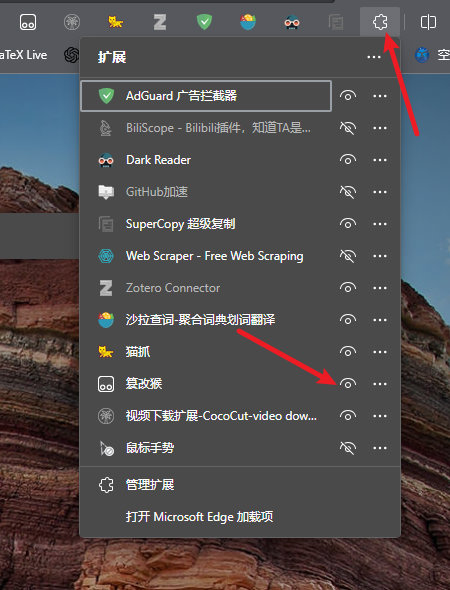
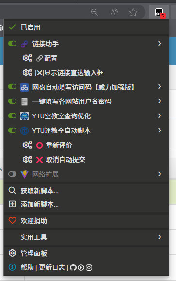

# YTU 评教自动化脚本

在烟大[回音壁](https://app.ytu.edu.cn/hyb/client/review/30964)上看到了：

> 参与今年教学评估时鄙人注意到今年的教学评估单项课程的评估中距离保存/提交开放的时间延长到了两分钟，也就使得每个人的总评估花费时长显著增长，私以为时间过长。个人理解教务处希望大家有更充裕的时间仔细评估的初衷……但是限制时间过长反而在一定程度上有损同学们认真评价的积极性。请老师明鉴

## 脚本分享

早就写过 YTU 自动评教脚本了，结果换新教务系统，原脚本挂了。重写了一下，现在可以用了。

对于熟悉 TamperMonkey/篡改猴的用户，将下列代码添加到篡改猴中即可。若不会操作，添加方法见下文。

```js
// ==UserScript==
// @name         YTU评教全自动脚本
// @namespace    http://tampermonkey.net/
// @version      0.1
// @description  全自动评教，自动打开未评教的，自动全打好，自动天信息
// @author       You
// @match        https://webvpn.ytu.edu.cn/*student*
// @match        https://ytu.edu.cn/*student*
// @match        http://202.194.116.132/student/teachingEvaluation/*
// @match        https://jwxs.ytu.edu.cn/student*
// @match        https://jwxs.ytu.edu.cn/*
// @match        https://jwxs.ytu.edu.cn*
// @match        https://jwxs.ytu.edu.cn/student/*
// @icon         https://www.ytu.edu.cn/images/bs5.png
// @grant        unsafeWindow
// @grant        GM_registerMenuCommand
// ==/UserScript==

// Select course page:
// https://webvpn.ytu.edu.cn/http/7772647671/student/teachingEvaluation/evaluation/index

const MATCH_KEYWORD = "(01)";
const EVALUATE_PAGE_URL_KEYWORD = 'teachingEvaluation';
const BUTTON_SELECTOR = 'div.radio-bj > label';
const DEFAULT_COMMENT = [
    '挺好的',
    '老师讲的很好',
    '内容很丰富',
    '老师讲的很好，课程设置让我收获很多',
    '老师讲的很好，课程设置很合理',
    '老师讲的很好，扩充的知识对我很有帮助',
];

function log(msg) {
    console.log(`%c[评教]%c${msg}`, 'font-size:16px;color:red', 'font-size:16px;color:black');
}

log('%cYTU自动评教脚本已启动', 'font-size:20px;color:red');

function randomOne(arr) {
    return arr[Math.floor(Math.random() * arr.length)];
}


/**
 * 在单一评教页面自动评教
 */
function autoClickAndSubmit() {
    log('开始自动评教');
    // make course name big
    let name = document.querySelector("div.profile-info-row > div:nth-child(4)");
    if (name !== null) {
        name.style.fontSize = '30px';
        name.style.fontWeight = 'bold';
        log(`正在评教课程：${name.innerText}`);
    }
    // works on ...teachingEvaluation/teachingEvaluation/evaluationPage
    if (document.location.href.indexOf(EVALUATE_PAGE_URL_KEYWORD) === -1) {
        log('自动评教失败：不在评教页面');
        return;
    }
    let subjectiveWrods = randomOne(DEFAULT_COMMENT);

    // click all buttons that has keyword choiceKeyword
    let options = document.querySelectorAll(BUTTON_SELECTOR);
    if (options.length === 0) {
        log('自动评教失败：未发现评教选项');
        return;
    }
    let clicked = 0;
    for (let b of options) {
        if (b.innerText.indexOf(MATCH_KEYWORD) !== -1) {
            b.click();
            b.querySelector('span.lbl')?.click();
            log(`已选择：${b.innerText}`);
            clicked++;
        }
    }
    if (clicked === 0) {
        log('没有任何匹配到的选项，请查看匹配关键词是否设置正确！');
        return;
    }
    // fill the textarea with subjectiveWrods
    document.querySelector('textarea.form-control.value_element').value = subjectiveWrods;
    log(`已填写：${subjectiveWrods}`);
    // wait for timedown
    let submit = document.querySelector('#savebutton')
    submit.style.fontSize = '24px';
    unsafeWindow.autoSubmitResult = true;
    log('使用\nunsafeWindow.autoSubmitResult = false;\n关闭自动提交')
    // remember the window title
    const title = document.title;
    let t = setInterval(function () {
        log(`剩余时间：${unsafeWindow.maxtime}`);
        document.title = `${title} (${unsafeWindow.maxtime})`;
        if (unsafeWindow.maxtime > 0) {
            return;
        }
        log('3 秒后自动提交！')
        setTimeout(() => {
            if (unsafeWindow.autoSubmitResult) {
                submit.click();
                log('自动提交成功！');
            } else {
                console.log(unsafeWindow.autoSubmitResult);
                log('已取消自动提交！调试值：' + unsafeWindow.autoSubmitResult);
            }
        }, 3000);
        clearInterval(t);
    }, 1000)
}

/**
 * 在选择评教课程页面自动打开最新未评教课程
 */
function openLatestNotEvaluatedCourse() {
    // works on /http/.../student/teachingEvaluation/evaluation/index
    if (document.location.href.indexOf('teachingEvaluation') !== -1) {
        let newButtons = document.querySelectorAll('td .btn-purple');
        if (newButtons.length > 0) {
            newButtons[0].click();
            console.log(`%c发现最新未评教课程(剩余${newButtons.length})`, 'font-size:20px;color:red');
        }
    }
}

(function autoFunctionDispatcher() {
    // avoid run many times
    unsafeWindow.hasAlreadyRun = undefined;
    setInterval(function () {
        // openLatestNotEvaluatedCourse();
        if (unsafeWindow.hasAlreadyRun) {
            return;
        }
        unsafeWindow.hasAlreadyRun = true;
        autoClickAndSubmit();
    }, 1000);
    GM_registerMenuCommand('⭕ 重新评价', autoClickAndSubmit)
    GM_registerMenuCommand('❌ 取消自动提交', () => {
        unsafeWindow.autoSubmitResult = false;
        log('已取消自动提交！调试值：' + unsafeWindow.autoSubmitResult);
    });
})();
```


## 安装方法

TamperMonkey 已有官方名称：**篡改猴**

内容来自[知乎](https://zhuanlan.zhihu.com/p/128453110)，进入浏览器自带的扩展市场，搜索 Tampermonkey，安装即可。随后，点击浏览器窗口右上角的油猴插件logo。


点击**添加新脚本**，会弹出新窗口，下面可以看到代码。


把下面默认的代码**全部删掉**，将上面那一大坨代码**完整地**复制粘贴进去，Ctrl+S 保存即可。

> 如果没有找到它的 logo，是浏览器给隐藏到折叠菜单内了，如 edge 浏览器默认会隐藏到拼图图标内。点击拼图图标，在下面找到 Tampermonkey 的 logo，点击右侧的小眼睛即可显示。
>
> 

## 脚本使用

进入 YTU 评教页面，点开一门课程的评教，可以看到所有选项都自动打上了最好选项，下面的主观评价也随机填写了内容。待倒计时结束，脚本会自动提交。脚本还贴心地把倒计时秒数更新到标签页的标题上，这样你可以一边做其他事情，一边观察倒计时。如果你不想让其自动提交，点击下图所示的“取消自动提交”按钮即可。



为什么不黑掉倒计时呢？因为我这么做了，页面后台有个叫 `maxtime` 的变量，你可以在控制台中访问到它。将其设为 -1 即可立即跳过倒计时。但评教[后端](https://zhuanlan.zhihu.com/p/337513783)对时间做了二次校验，这样直接提交会被拒绝。这个拒绝消息还不会显示出来，会弹一个空文本框，我在监控网络流量的地方发现此 API 返回的数据中提示了错误。所以我只能等倒计时结束后再提交。

> Tips: 评教页面按 F12 打开控制台，你可以看到此脚本的调试输出信息。